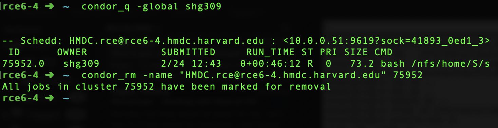

## Option 1: X-forwarding

!!! note
    - Gives you the actual window running Stata, but suffers from latency issues, which means that the screen will be stuttery

### Setup

**MacOS:**

- Install [Xquartz](https://www.xquartz.org/)
- Edit `~/.ssh/config` and add:
```
    Host *
        XAuthLocation /opt/X11/bin/xauth
        ForwardX11 yes
        ForwardX11Trusted yes
```

**Windows:**

- In PuTTy, enable X11 forwarding

**Linux:**

- No setup required! X11 is pre-installed
- You might have to edit `~/.ssh/config` to allow X11 forwarding (same as MacOS)

### Running Stata

- `ssh` to the RCE, adding a `-Y` flag to the command.
    + You can use `-X` (untrusted X11 forwarding) or `-Y` (trusted X11 forwarding, slightly smoother)
    + `-Y` is less secure, so only use it for applications you recognize (such as Stata)
```bash
# Replace "<rce_username>" with your RCE username
ssh -Y <rce_username>@rce.hmdc.harvard.edu
```
- Run the RCE provided convenience-command to start STATA jobs, with a graphical interface:
```
rce_submit.py -r -graphical -a xstata-mp
```

For commonly used commands and introductory tutorials, refer to [RCE documentation](https://rce-docs.hmdc.harvard.edu/book/rce-docs).


## Option 2: Jupyter Lab

!!! note
    - Thanks to [Kyle Barron's](https://github.com/kylebarron) package [`stata_kernel`](https://kylebarron.github.io/stata_kernel), we can use Stata kernels for Jupyter, allowing us to run Stata remotely with low latency.
    - However, Jupyter notebooks are not text files, so working with them does not have the do-file editor *feel* that Stata users might be used to.
    - Additionally, Jupyter notebooks are harder to manage using Git

### Setup

1. SSH into the cluster, using portforwarding

    ```bash
    # Replace "<rce_username>" with your RCE username
    ssh -L 8889:localhost:8889 <rce_username>@rce.hmdc.harvard.edu
    ```

2. Load `conda` into the shell

    !!! warning
        Be careful while editing `~/.bashrc` and `~/.bash_profile` files - they are executed each time your shell opens, and you don't want to mess it up and be unable to access your account.

    Add the following line (exactly as it is, including the period) to your `~/.bashrc`:

    ```bash
    . /nfs/tools/lib/anaconda/3-5.2.0/etc/profile.d/conda.sh
    ```

    If you aren't sure how to do this, run the following command and it'll do it for you:

    ```bash
    echo ". /nfs/tools/lib/anaconda/3-5.2.0/etc/profile.d/conda.sh" >> ~/.bashrc
    ```

3. Create and prepare a conda environment, and activate it with the following commands:
    ```bash
    # Navigate to a folder with >10GB available space (one of your shared_space dirs)
    # Ideally this path should have no spaces
    # Example: cd ~/shared_space/cid_saudi/shreyas/misc/envs/
    cd ~/shared_space/<rest_of_path>
    mkdir cid_env && cd cid_env
    # Create conda environment in the current folder
    conda create --prefix=cid python=3
    # Set required environment variables to specify location of environment
    # Example: export CONDA_ENVS_PATH="/nfs/projects_nobackup_ci3/m/ci3_mastercard/shared_space/ci3_mastercard/shreyas/utils/envs/"
    # Example: export CONDA_PKGS_DIRS="/nfs/projects_nobackup_ci3/m/ci3_mastercard/shared_space/ci3_mastercard/shreyas/utils/pkgs/"
    echo "export CONDA_ENVS_PATH=\"<path_to_environment>\"" >> ~/.bashrc
    echo "export CONDA_PKGS_DIRS=\"<path_to_packages>\"" >> ~/.bashrc
    # Activate conda environment (can now be done from any folder)
    conda activate cid
    # Install necessary packages
    ## Add conda-forge as the main channel for downloading packages (optional)
    conda config --add channels conda-forge
    ## Download required packages
    conda install -c conda-forge jupyterlab nodejs
    ```

4. Install STATA for Jupyter
    ```bash
    ## Install stata_kernel
    pip install stata_kernel
    python -m stata_kernel.install
    ## Install JupyterLab Extension for Stata syntax highlighting
    jupyter labextension install jupyterlab-stata-highlight
    ```
5. Prepare condor submission and connection scripts
    ```bash
    # Make a directory somewhere to house the condor scripts
    mkdir -p ~/condorscripts/condorlogs && cd ~/condorscripts
    # Download Jupyter submission script from Github Repo
    curl -O https://raw.githubusercontent.com/cid-harvard/workshop-cluster-training/master/assets/condorscripts/jupyter.submit
    # Automatically replace "~" in jupyter.submit with the absolute path to your HOME directory
    sed -i 's@\~@'"$HOME"'@' jupyter.submit
    # Download Jupyter connection script
    curl -O https://raw.githubusercontent.com/cid-harvard/workshop-cluster-training/master/assets/condorscripts/condorsshrce.sh
    # Automatically replace "username" with the username
    sed -i 's/username/'"$USER"'/' condorsshrce.sh
    # Download shell script to activate conda env named 'cid' and run Jupyter
    curl -O https://raw.githubusercontent.com/cid-harvard/workshop-cluster-training/master/assets/condorscripts/run_jupyter.sh
    # Replace "<your_token>" with token of your choice
    # Example: sed -i 's/my_token/example_token/' run_jupyter.sh
    sed -i 's/my_token/<your_token>/' run_jupyter.sh
    ```

### Running Stata through Jupyter
1. SSH into the cluster, using portforwarding (if you haven't yet)

    ```bash
    # Replace "<rce_username>" with your RCE username
    ssh -Y -L 8889:localhost:8889 <rce_username>@rce.hmdc.harvard.edu
    ```

2. Submit Jupyter job
    ```bash
    # Submit condor script
    condor_submit ~/condorscripts/jupyter.submit
    ```
3. Use [tmux](https://www.hamvocke.com/blog/a-quick-and-easy-guide-to-tmux/) to handle connection errors/closures
    ```bash
    # Start a new tmux window
    tmux new
    # SSH to the machine running your jupyter server
    . ~/condorscripts/condorsshrce.sh $USER
    ```

    ??? tip "Tip: tmux keyboard shortcuts and commands"
        - New tmux window: `tmux new`
        - Detach tmux window: `ctrl+b`, then `d`
        - Reattach latest tmux window: `tmux a`
        - New horizontal pane: `ctrl+b`, then `"`
        - New vertical pane: `ctrl+b`, then `%`
        - Kill current pane: `ctrl+b`, then `x`, then `y`
        - Move between panes: `ctrl+b`, then arrow keys
        - Stop moving, or cancel a tmux-specific command: `escape`
        - Kill all tmux sessions: `tmux kill-server`

4. In your browser, go to `localhost:8889`, and voila!
5. Once you're done, you can close the compute node using `ctrl+d`, you might then have to press `ctrl+c` if your login node is taking time to appear
6. Remember to remove the job once you're finished:

    ```bash
    # Look up running jobs
    condor_q -global $USER
    # Remove job
    condor_rm -name "<machine_name>" <ID>
    ```

    ??? example "Example"
        


## Option 3: Atom + Hydrogen

!!! note
    - The text editor Atom, using the package Hydrogen, allows you to run code interactively, inspect data and plot using Jupyter kernels. This method uses [`stata_kernel`](https://kylebarron.github.io/stata_kernel) as well.
    - Recommended option! Provides a do-file like *feel*, with low latency (i.e. no stuttering).

### Setup

#### Setting up the Jupyter Kernel

The steps for setting up the Jupyter kernel are the same as for [*Option 2: Jupyter Lab*](#option-2-jupyter-lab).

#### Setting up Atom

You can learn some Atom basics [here](https://flight-manual.atom.io/getting-started/sections/atom-basics)

1. Install required packages

    To install a package on atom, press `Cmd+Shift+P` (Mac) or `Cmd+Shift+P` (Windows) to enter the "Command Palette", and type `Install Packages`. Install the following packages:

    - [remote-ftp](https://atom.io/packages/remote-ftp): enable browsing remote files
    - [hydrogen](https://atom.io/packages/hydrogen): run code through jupyter kernels
    - [language-stata](https://atom.io/packages/language-stata): stata code linting

    Optional (my favourite add-ons):

    - [tree-view](https://atom.io/packages/tree-view): explore files in project
    - [file-icons](https://atom.io/packages/file-icons): convenient file icons in tree view
    - [atom-beautify](https://atom.io/packages/atom-beautify): automatically indent / beautify code according to linters
    - [open-recent](https://atom.io/packages/open-recent): open recently opened files / projects
    - [teletype](https://atom.io/packages/teletype): collaborate on code in real-time (think google docs for code)
    - [highlight-selected](https://atom.io/packages/highlight-selected): highlight all occurrences of selected word or phrase
    - [minimap](https://atom.io/packages/minimap): mini view of the code on the side

2. Configure `remote_ftp`

    - Create an empty folder in your computer. Call it `remote_atom` (or any other name you might see fit).
    - Open Atom and click "File -> Open -> `remote_atom`". This will open the `remote_atom` folder as a "project".
    - Open the Command Palette (`Cmd+Shift+P` or `Ctrl+Shift+P`) and type "Create Sftp" and choose the option "Remote Ftp: Create Sftp Config File". You will notice that a file named `.ftpconfig` is automatically created in the same folder.
    - Replace the contents of the file with the following, modifying the `user` and `remote` parameters:

    ```json
    {
        "protocol": "sftp",
        "host": "rce.hmdc.harvard.edu", // string - Hostname or IP address of the server. Default: 'localhost'
        "port": 22, // integer - Port number of the server. Default: 22
        "user": "<username>", // string - Username for authentication. Default: (none)
        "promptForPass": true, // boolean - Set to true for enable password/passphrase dialog. This will prevent from using cleartext password/passphrase in this config. Default: false
        "remote": "/nfs/home/S/shg309/ <replace with your own home folder>", // try to use absolute paths starting with /
        "connTimeout": 10000, // integer - How long (in milliseconds) to wait for the SSH handshake to complete. Default: 10000
        "keepalive": 10000 // integer - How often (in milliseconds) to send SSH-level keepalive packets to the server (in a similar way as OpenSSH's ServerAliveInterval config option). Set to 0 to disable. Default: 10000
    }
    ```

    - Open the Command Palette and type "Remote Ftp", and choose the option `Toggle`. This will open up a `Remote` tab on the left hand side.
    - In the `Remote` tab, click on `Connect`, and voila! You can now edit files on the cluster as if they were on your own computer!

    !!! warning
        - Don't use the `remote_atom` project unless you're working on the cluster. The files in the folder are uploaded automatically to the cluster when you reconnect.

    !!! note
        - Once you're done, remember to `Disconnect`.
        - Optional: Through the Command Palette, go to "View Installed Packages" --> remote_ftp's settings --> change `Auto Upload on Save` from `always` to `only when connected`

3. Configure Hydrogen

    - Through the Command Palette, go to "View Installed Packages" --> hydrogen's settings --> change `Kernel Gateways` to the following (replace `<your_token>` with the token you set for Jupyter earlier):

    ```json
    [{"name":"RCE Jupyter", "options":{"baseUrl":"http://localhost:8889", "token":"<your_token>"}}]
    ```

### Running Stata through Hydrogen

1. Connect to Remote Kernel

    - Open a Stata `.do` file
    - Through the Command Palette, go to "Connect to Remote Kernel".

    ??? note "First-time users"
        If this is the first time you're connecting, you might be asked to "Authenticate Using Token". To find the authentication token, on an RCE node, type the following:

        ```bash
        # Activate conda environment
        conda activate cid
        # Get Jupyter token
        jupyter notebook list
        ```

        The token will be of the form:

        <pre><code>
        http://localhost:8889/?token=<mark>a61elkjziunns1523e70eb18a452cfsdf9812302199b87e</mark>
        </pre></code>

2. Running code

    - Select code you want to run, and hit `Cmd+Enter` (Mac) or `Ctrl+Enter` (Windows)
    - To run all code, hit `Cmd+Option+Enter` (Mac) or `Ctrl+Alt+Enter` (Windows)

3. Magics

    - For browsing data, you can use the `%browse` magic:

    ```stata
    webuse auto
    scatter mpg weight
    %browse 100 mpg
    ```

    - Refer to [this page](https://kylebarron.github.io/stata_kernel/using_stata_kernel/magics/) for more Jupyter+Stata magics.
