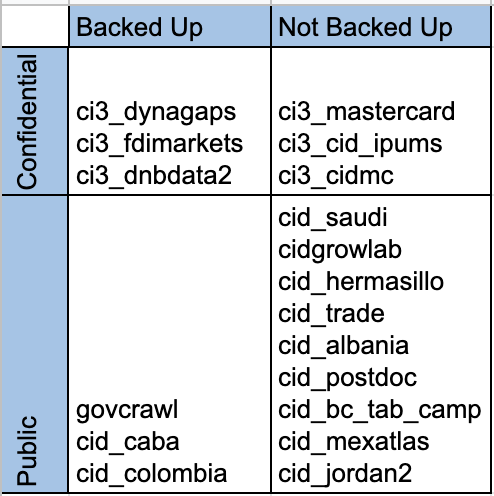

# CID Data Workshops

Data Management and Effective Cluster Usage

---

# Motivation

---

# Motivation

- Power-users of the cluster
- Inadequate documentation on cluster usage, designed for casual users
- Exasperation directed towards the cluster
- Interest in data management
- Evolving data management practices

---

# Acknowledgements

- Feedback sessions
- Stock-taking sessions
- Early adopters

---

# Pre-requisites

- Windows: Install PuTTy
- Install Atom

---

# Data Management Exercise

- Use data management checklist

- Regular data users
    + Think about *your* data
    + Consider specific datasets

- Data facilitators
    + Think about the data that you have facilitated
    + Think about institutional processes for items on the checklist

---

# Stock-taking

- What data do you have / expect to get?
- What special needs do these data create, if any?

---

# Responsibilities

- Enforcement: one person per project
- For specific dataset(s) *you* work with: who is responsibile for them?

---

# Data Backup Strategy

---

# Storage and Backup

- Cluster backup discussions with RCE
- Consider regular external disk backups for sensitive data

---

# File organization and naming systems

- Come up with a system and **stick to it**
- Document the system

---

# Data Security Strategy

---

# Access and security

- Cluster security discussions
- Data security levels: http://security.harvard.com/dct

---

# Documentation of Rules and Conventions

- Are your project's data management rules / conventions easily accessible?
- Do you have an orientation packet for new joinees?

___

# Ethics and Privacy

- *Your* responsibility
- Does your project need an IRB review?
- Do you need / have an IRB ethics certification?

---

# Folder Structures

- Raw: Immutable
- Processed: Clean, centrally available
- Intermediate: Irrelevant
- Personal folders: Derivatives of "Processed"

---

# Cluster Training

Website: https://cid-harvard.github.io/workshop-cluster-training

---
